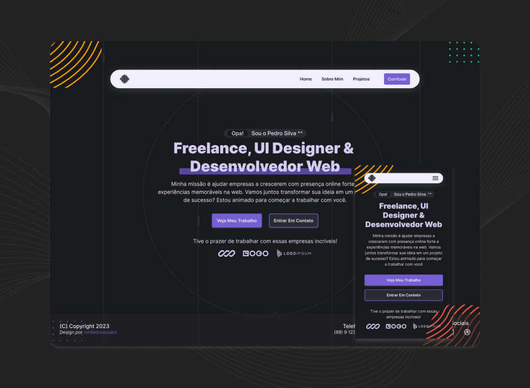

# Portfólio usando HTML, CSS e JS

Este é um projeto simples de HTML e CSS que criei para praticar minhas habilidades de desenvolvimento web. Ele consiste em uma página única com um design responsivo e algumas animações CSS.

<br>

<p>
  
</p>

## 📂 Estrutura de pasta

```
css                   // style.css e bg.css
script              // navbar script
assets
|-- design        // screenshots do layout
|-- images       // svgs do projeto
index.html
readme.md
style-guide.md
```

<hr/>

## 🚀 Tecnologias

Esse projeto foi desenvolvido com as seguintes técnicas:

- HTML5 & CSS3
- Mobile first
- Flexbox e Grid CSS
- Animações CSS para efeitos visuais.
- SVG Sprite\*

<hr/>

Para os SVGs criei um sprite. Sprite nada mais é que um único documento grande com todos os SVGs.
Optei pelo o sprite para dimnuir a quantidade código XML no HTML.

Por curiosidade também é possivel criar sprite a partir de grupo de imagens em `style-guide` mostro como usar cada um.

Vale ressaltar que pode occorrer que os elemntos SVGs não seja renderizado na tela.
Tenho contonado isso repassando novamente o caminho do arquivo.

```html
<svg>
  <use xlink:href="assets/images/sprite.svg#logo"></use>
</svg>
```

<hr/>

## Código javascript foi refatorado pelo chatGPT

- Redução no número de variáveis e seletores.
- Função _arrow_ ao invés de _function_ para melhorar a legibilidade.
- Usar _querySelectorAll_ e um _for_ loop para simplificar o processo de adicionar eventos a múltiplos elementos.

<hr/>

## Funcionalidades

- Design moderno e atraente.
- Menu mobile:
  - O código tem uma interação com usuários de dispositivos móveis.
  - O usuário pode clicar no botão toggle (ícone de hamburguer) para abrir ou fechar o menu.
  - Caso clique em algum dos links, o menu será fechado e redirecionará o usuário para a página vinculada ao link. O link passa a está destacado naquela seção
  - Se o usuário clicar em qualquer área do site (excerto o próprio menu), o menu será fechado.

<hr/>

## Recursos úteis

- [Figma](https://www.figma.com) - Para criação e prototipação do layout
- [Remix Icon](https://remixicon.com/) - Webfont Icons gratuitos (tem plugin para Figma também)
- [Fluid Type Scale](https://www.fluid-type-scale.com/) - Gera variáveis de tamanho de fonte para uma escala de tipo fluido com clamp CSS.
- [Dopely color](https://colors.dopely.top/color-pedia) - Otimo site para para obter informações sobre cores, como tint & shades, harmonia de cores, verificação de contraste e muito mais!
- [Logoipsum](https://logoipsum.com/) - logotipo de espaço reservado gratuito que você pode usar em seu design.
<hr/>

## 🔖 Layout

Você pode visualizar o layout do projeto através [desse link](https://www.figma.com/community/file/1242927375221681165). É necessário ter conta no [Figma](https://figma.com) para acessá-lo.

<hr/>

## 👥 Contribuição

Sinta-se à vontade para contribuir com este projeto. Você pode abrir _issues_ para relatar _bugs_ ou sugerir melhorias. Se preferir, você também pode enviar um _pull request_ com suas alterações.

Ainda há muito em que eu gostaria de melhorar nesse layout, sendo assim continuarei a trabalhar nele conforme o passar do tempo.

<hr/>

## 📑 Licença

Este projeto está licenciado sob a licença MIT. Consulte o arquivo `LICENSE` para obter mais informações.
